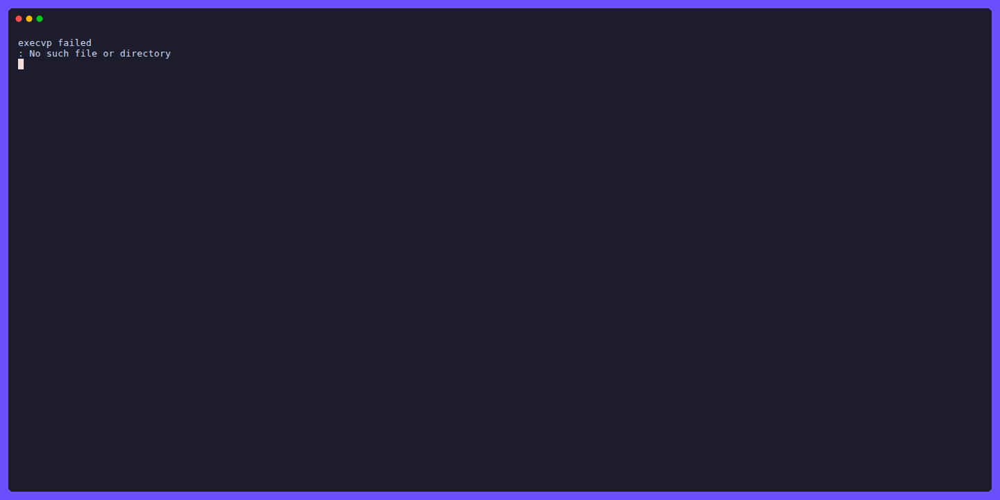

# tele

```
  _            _
 | |_    ___  | |   ___
 | __|  / _ \ | |  / _ \
 | |_  |  __/ | | |  __/
  \__|  \___| |_|  \___|
```

> Keyboard-driven TUI Telegram client for the terminal

[](https://go.dev)
[](LICENSE)
[](https://github.com/sorokin-vladimir/tele/releases)
[](#installation)

<p align="center">
  <a href="#features">Features</a> •
  <a href="#installation">Installation</a> •
  <a href="#why-tele">Why tele?</a> •
  <a href="#keybindings">Keybindings</a> •
  <a href="#roadmap">Roadmap</a>
</p>

<!-- TODO: record a demo GIF (e.g. with asciinema + agg) and save to assets/demo.gif -->
<!--  -->

> **Status:** Active development. Already usable for daily messaging — private chats, groups, replies, reactions. Some Telegram features are still in progress.

## Why tele?

Telegram Desktop, the web version, and mobile apps are built for mouse-first interaction. If you live in the terminal — editing in [Neovim](https://neovim.io), navigating with [yazi](https://yazi-rs.github.io), monitoring with [k9s](https://k9scli.io) — switching to a GUI messenger breaks your flow.

`tele` keeps you in the terminal. Navigate chats with `j`/`k`, open and reply to messages without touching the mouse, and run it over SSH on a remote machine. If lazygit feels natural to you, `tele` will too.

It also runs lean: ~35 MB RSS at idle vs several hundred for a desktop client.

| Feature              | tele           | Telegram Desktop | Web        |
| -------------------- | -------------- | ---------------- | ---------- |
| Terminal-native      | ✅             | ❌               | ❌         |
| Keyboard-first       | ✅             | ⚠️ partial       | ⚠️ partial |
| Works over SSH       | ✅             | ❌               | ❌         |
| Single static binary | ✅             | ❌               | ❌         |
| Full media support   | ⚠️ photos only | ✅               | ✅         |
| Voice/video calls    | ❌ planned     | ✅               | ✅         |

## Installation

### macOS / Linux — Homebrew

```sh
brew tap sorokin-vladimir/tele
brew install tele
```

### Linux — binary

```sh
curl -sL https://github.com/sorokin-vladimir/tele/releases/latest/download/tele-linux-amd64 \
  -o ~/.local/bin/tele && chmod +x ~/.local/bin/tele
```

For arm64: replace `tele-linux-amd64` with `tele-linux-arm64`.

## First launch

```sh
tele
```

On first run, `tele` creates `~/.config/tele/config.yml` and prompts you to log in: phone number → SMS code → 2FA password (if set).

## Features

- Vim-style navigation — `j`/`k`, `gg`/`G`, `i`/`Esc`
- Telegram folders (archived chats, custom folders)
- Send, reply, edit and delete messages
- Reactions — view and send
- Photos — open in external viewer
- Chat search (`/`)
- Date separators in chat history
- Configurable via YAML
- Single static binary — no runtime dependencies

## Keybindings

### Global

| Key                       | Action          |
| ------------------------- | --------------- |
| `0`                       | Focus folders   |
| `1` / `h` / `←`           | Focus chat list |
| `2` / `l` / `→`           | Focus chat      |
| `q` / `Ctrl+Q` / `Ctrl+C` | Quit            |

### Chat list

| Key                 | Action                     |
| ------------------- | -------------------------- |
| `j` / `↓`           | Next chat                  |
| `k` / `↑`           | Previous chat              |
| `G`                 | Last chat                  |
| `Ctrl+D` / `Ctrl+U` | Scroll half-page down / up |
| `Enter`             | Open chat                  |
| `/`                 | Search chats               |

### Chat (normal mode)

| Key       | Action                         |
| --------- | ------------------------------ |
| `j` / `↓` | Scroll down                    |
| `k` / `↑` | Scroll up                      |
| `gg`      | Scroll to top                  |
| `G`       | Scroll to bottom               |
| `i` / `a` | Compose message (insert mode)  |
| `r`       | Reply to message               |
| `t`       | React to message               |
| `e`       | Edit own message               |
| `d`       | Delete own message             |
| `g`       | Jump to original (for replies) |
| `o`       | Open photo in external viewer  |
| `Space`   | Context menu                   |

### Compose (insert mode)

| Key     | Action              |
| ------- | ------------------- |
| `Enter` | Send message        |
| `Esc`   | Back to normal mode |

## Configuration

`~/.config/tele/config.yml`:

```yaml
telegram:
  session_file: ~/.config/tele/session.json

ui:
  date_format: "15:04"
  history_limit: 50
  theme: default
```

## Roadmap

See the [GitHub milestones](https://github.com/sorokin-vladimir/tele/milestones) for the full roadmap.

| Phase   | Status         | Focus                                                  |
| ------- | -------------- | ------------------------------------------------------ |
| Phase 2 | 🔄 In progress | Usability fixes, input improvements, scroll indicator  |
| Phase 3 | 📋 Planned     | @mentions, forward, typing indicator, online status    |
| Phase 4 | 📋 Planned     | Vim motions, command palette, themes, full-text search |

## Build from source

Requires Go 1.22+ and your own [Telegram API credentials](https://my.telegram.org).

```sh
git clone https://github.com/sorokin-vladimir/tele
cd tele
go build \
  -ldflags "-X main.buildAPIID=YOUR_API_ID -X main.buildAPIHash=YOUR_API_HASH" \
  -o tele ./cmd/tele/
```

## License

[GPL-3.0](LICENSE) — free to use and fork; derivative works must remain open-source.

Inspired by [lazygit](https://github.com/jesseduffield/lazygit). Built with [gotd/td](https://github.com/gotd/td), [bubbletea](https://github.com/charmbracelet/bubbletea) and [lipgloss](https://github.com/charmbracelet/lipgloss).
